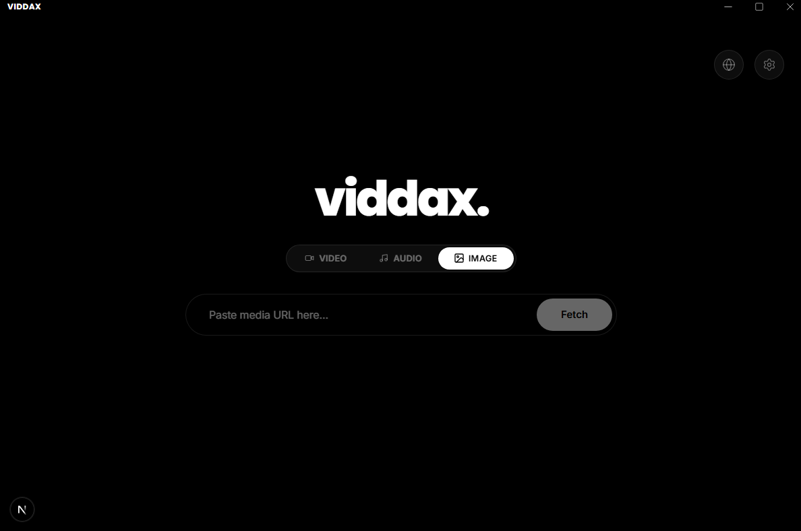

<div align="center">
  

  # Viddax.

  **A beautifully crafted, minimalist, and blazing-fast media downloader.**

  [](https://reactjs.org/)
  [](https://nextjs.org/)
  [](https://www.electronjs.org/)
  [](https://github.com/yt-dlp/yt-dlp)
  <br />
  [](https://nerdblud.github.io/Viddax)

</div>

<br />

<div align="center">
  
</div>

<br />

## 🌟 What is Viddax?

Viddax is a modern desktop application that completely reimagines how you download media from the internet. By combining the unparalleled downloading power of **yt-dlp** and **FFmpeg** with a sleek, next-generation **React & Electron** interface, Viddax offers a premium, ad-free, and natively smooth experience.

Gone are the days of using shady, ad-ridden web downloaders or fighting with complicated command-line interfaces. Viddax makes downloading high-quality video, audio, and images as simple as pasting a link, while still offering all the advanced features that power users demand.

---

## ✨ Key Features

### 🎨 The "Butter Smooth" UI
Viddax was designed with aesthetics as a top priority. Built with **Vanilla SCSS Modules** and animated by **Framer Motion**, every interaction—from toggling modes to typing in the search bar—feels fluid and responsive. The interface embraces a minimalist, dark-mode glassmorphic design that looks stunning on any desktop.

### 🧠 Smart Auto-Detector
Why click through menus when the app can do the thinking for you? As soon as you paste a link, Viddax instantly analyzes the URL. A slick animation will drop down to confirm the recognized platform (e.g., YouTube, TikTok, Reddit, Spotify) and dynamically adjust the available download modes based on what that platform supports.

### 🎬 Tri-Mode Extraction
Seamlessly switch between what you want to extract:
- **Video Mode:** Grab up to 8K HDR video (with options to force specific codecs like H.264, AV1, or VP9).
- **Audio Mode:** Extract high-bitrate music (320kbps MP3, FLAC, Opus) from music videos, SoundCloud, or Spotify.
- **Image Mode:** Pull pristine video thumbnails, Instagram photos, or TikTok story images directly.

### ⚙️ Power-User Settings Engine
Hidden behind a clean settings panel is a highly capable engine designed for edge-cases:
- **Rate Limiting & Concurrency:** Prevent IP bans by throttling download speeds and managing simultaneous download queues.
- **Network & Proxy:** Easily plug in a Socks5/HTTP proxy string to bypass geo-restrictions and region locks.
- **Authentication:** Enable browser cookie impersonation to seamlessly download age-restricted or private content.
- **Metadata & Subtitles:** Choose whether to embed custom subtitles, auto-translate captions, or embed the video thumbnail as the cover art.

---

## 📖 How to Use

Using Viddax is incredibly straightforward:

1. **Find your media:** Copy the link to a video, song, or post from your browser.
2. **Paste it in:** Click the central input bar in Viddax and paste the URL.
3. **Wait for detection:** Watch as Viddax instantly recognizes the platform and confirms compatibility.
4. **Choose your mode:** Select whether you want the **Video**, the **Audio**, or just the **Image**.
5. **Hit Fetch:** Viddax handles the heavy lifting, automatically selecting the best available quality and merging streams in the background.

*Pro tip: Click the gear icon in the top right to customize your default download paths, preferred quality formats, and filename naming structures!*

---

## 🌍 Supported Platforms

Because Viddax is powered by `yt-dlp`, it supports **over 1,000+ different websites**. If it hosts media, Viddax can probably download it. 

Some of the most popular platforms with optimized detection include:
- **YouTube** (Including Shorts, Playlists, and Music)
- **TikTok**
- **Instagram** (Reels, Posts, IGTV)
- **X / Twitter**
- **Reddit**
- **Facebook**
- **Twitch** (VODs and Clips)
- **Spotify** & **SoundCloud**
- **Snapchat** (Spotlight & Stories)
- **Vimeo** & **Dailymotion**
- **Bilibili**
- **Mixcloud** & **Apple Music/Podcasts**
- **Patreon**

---

## 🚀 Getting Started (For Developers)

Want to build Viddax from source or contribute to the project? Here is how to get it running locally.

### Prerequisites

You will need **Node.js** (v18+) and **npm** installed on your system. 

*(Note: Viddax bundles its own copies of `yt-dlp` and `FFmpeg`, so you don't need them pre-installed on your system!)*

### Installation

1. **Clone the repository:**
   ```bash
   git clone https://github.com/yourusername/viddax.git
   cd viddax
   ```

2. **Install dependencies:**
   ```bash
   npm install
   ```

3. **Run the development server:**
   ```bash
   npm run electron:dev
   ```
   *This command fires up the Next.js local server and launches the Electron wrapper simultaneously.*

---

## 📦 Building the Executable

Ready to share Viddax with the world? You can compile the entire application into a standalone `.exe` Windows Installer with a single command:

```bash
npm run electron:build
```

The build script automatically exports the static React frontend, bundles the necessary backend binaries safely out of the `.asar` archive, and generates the final setup file inside the `release/` directory.

---

## 🛠 Tech Stack

Viddax bridges the gap between modern web development and native desktop applications:

- **Frontend:** Next.js 16 (App Router, Static Export), React 19
- **Styling:** Vanilla SCSS Modules (Zero Tailwind, fully custom architecture)
- **Animations:** Framer Motion
- **Icons:** Lucide React
- **State Management:** Zustand
- **Desktop Framework:** Electron, Electron-Builder
- **Download Engine:** yt-dlp (bundled alongside FFmpeg/FFprobe)

---

## 📄 License

This project is licensed under the MIT License. See the [LICENSE](LICENSE) file for details.

<div align="center">
  <sub>Built with ❤️ by Nerdblud</sub>
</div>
